# Product Requirements Document
## CampusSync — AI-Powered Campus Notification Assistant

**Hackathon:** AMD Slingshot Hackathon  
**Theme:** Open Innovation  
**Status:** Prototype

---

## 1. Overview

### 1.1 Problem Statement

College students today are members of dozens of WhatsApp groups and email chains — placement cells, academic departments, event committees, hostel boards, club announcements, and more. The volume of messages is overwhelming and completely unfiltered. Important events, deadlines, and opportunities get buried in noise, and students miss them entirely.

### 1.2 Solution

CampusSync is an AI-powered event aggregator that connects to college WhatsApp groups, ingests all incoming messages in real time, and displays every event as a clean structured card — sorted by date. The AI extracts eight fields from each message: event name, poster, description, registration link, date, venue, branch eligibility, and category. All events are visible to everyone by default. Students can search or filter by category, branch, or keyword to narrow down what they see.

### 1.3 Tagline

> *"Stop drowning in group chats. CampusSync finds what matters to you."*

---

## 2. Goals

### Prototype Goals (Hackathon)
- Demonstrate a live Baileys bot ingesting real messages from WhatsApp groups
- Display all AI-extracted events as structured cards sorted by date — no raw feed, no unprocessed messages shown
- Show AI-extracted structured fields: name, poster, description, link, date, venue, branch, category
- Allow users to search and filter by category or branch
- Deliver a clean, demoable React frontend with no login required

### Product Goals
- Become the single event discovery layer for every student on campus
- Reduce time spent hunting across group chats by 80%
- Ensure zero missed deadlines across the campus
- Scale to support email ingestion alongside WhatsApp

---

## 3. Target Users

**Primary:** Undergraduate college students (Years 1–4) — browsing all campus events  
**Secondary:** Students looking for specific events by category or branch  
**Tertiary:** College administration wanting better announcement reach

---

## 4. Core Features

### 4.1 WhatsApp Bot Integration
The backbone of the product. A Baileys-powered bot connects to WhatsApp Web via QR scan using a dummy WhatsApp account. Once added to college groups, it listens for all incoming messages in real time and pipes them to the backend for AI processing.

**Supported group types:** Academic / Department, Placement & Internship, Events & Clubs, Hostel / Campus life, Exam circulars

### 4.2 All Events Feed (Default View)
On launch, CampusSync displays every AI-processed event from all connected WhatsApp groups — no profile, no login, no filtering needed. Events are sorted chronologically, soonest first. Every student sees the same complete structured feed by default.

### 4.3 AI Structured Event Extraction
The core AI feature. Gemini receives raw WhatsApp messages and extracts each relevant message into a fully structured event object with eight dedicated fields:

| Field | Description |
|---|---|
| **Event Name** | Short title of the event or announcement |
| **Poster** | Image URL if a poster was shared in the group, else null |
| **Description** | Full context of the event in clean readable prose |
| **Registration Link** | Any URL found in the message for registration or more info |
| **Date** | Parsed ISO date string of the event or deadline |
| **Venue** | Physical location or online platform |
| **Branch** | Which branch(es) this event is intended for — e.g. CSE, ECE, All, ME+CE |
| **Category** | Type of event — classified by Gemini from the predefined list below |

### 4.4 Event Categories
Gemini classifies every event into exactly one of the following categories:

| Category | Description |
|---|---|
| **Hackathon** | Competitive coding or building events |
| **Seminar** | Guest lectures, talks, panel discussions |
| **Workshop** | Hands-on skill sessions |
| **Placement** | Job drives, internship opportunities, company visits |
| **Exam** | Internal assessments, makeup tests, exam circulars |
| **Cultural** | Fests, performances, art and music events |
| **Sports** | Athletic events, trials, tournaments |
| **Deadline** | Registration or submission deadlines with no physical event |
| **General** | Announcements that don't fit any other category |

### 4.5 Search & Filter
Students can narrow the all-events feed using keyword search across event name and description, category filter chips for each of the 9 categories, and a branch filter to show only events for a specific branch or all branches. Filters can be combined. Clearing all filters returns to the full default feed.

**General category UI treatment:** Events classified as `General` appear in the feed but the `General` chip is visually de-emphasized — rendered smaller and in muted grey compared to other category chips. This prevents low-value catch-all announcements from dominating the filter bar. The chip is still functional and can be selected.

### 4.6 Date-Based Sorting
All events are sorted chronologically — soonest date first. Within the same date, events are sub-sorted by category urgency (Exam > Deadline > Placement > others). Events with no extractable date are placed at the bottom under an "Undated" section.

### 4.7 Real-Time Updates
Socket.io pushes newly processed events to the frontend instantly. New event cards appear at the correct date position in the feed without any page refresh.

---

## 5. Technical Architecture

### 5.1 System Overview

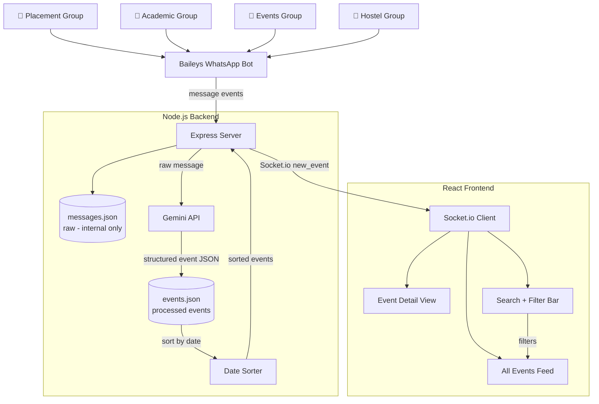

### 5.2 Frontend Component Tree

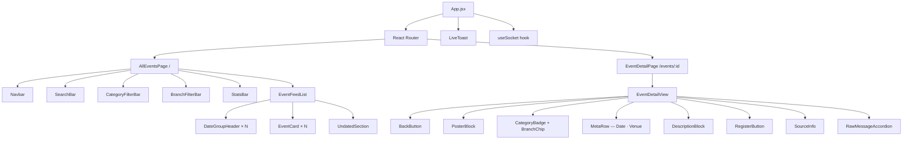

### 5.3 Message Processing Pipeline

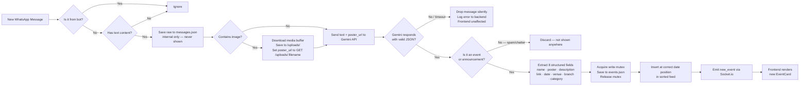

**Image handling:** When a WhatsApp message contains an image, Baileys downloads the raw media buffer. The backend saves it to `./uploads/<uuid>.jpg` and serves it at `GET /uploads/:filename`. The `poster_url` field in the event object is set to this internal URL, which the frontend uses to render the poster thumbnail and hero image.

**Error handling:** If Gemini returns invalid JSON (malformed response, timeout, or API error), the message is silently dropped — it does not appear anywhere in the frontend. A timestamped error entry is written to the backend log. No crash or user-visible error occurs.

**Concurrent write safety:** All writes to `events.json` are serialized via an in-memory async queue (Promise chain). This prevents file corruption when multiple Gemini responses resolve simultaneously.

### 5.4 Gemini Category Classification Logic

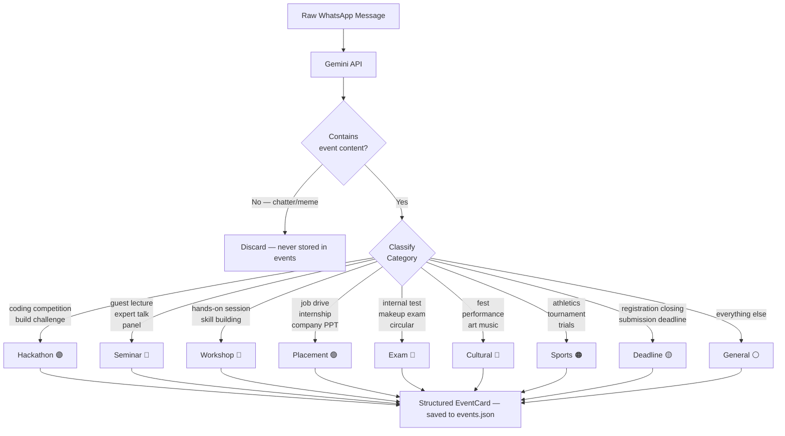

### 5.5 Event Data Flow & Sorting

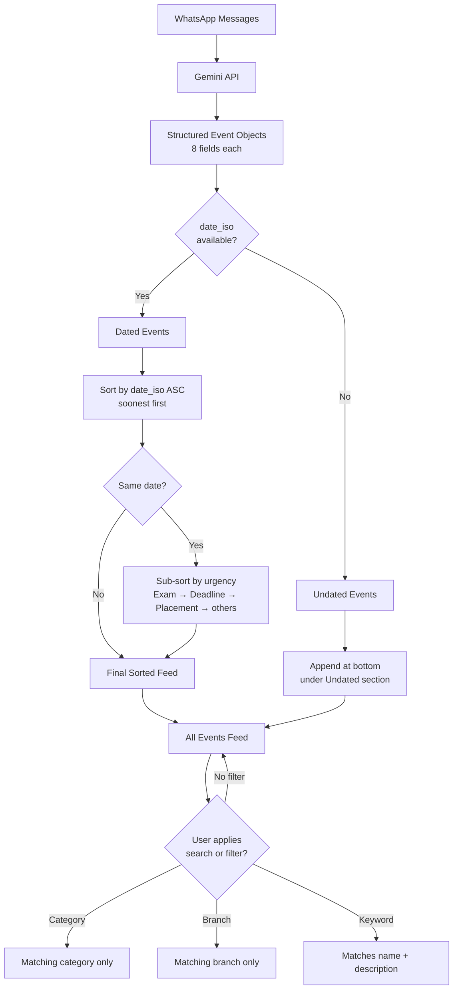

### 5.6 Filter State Machine

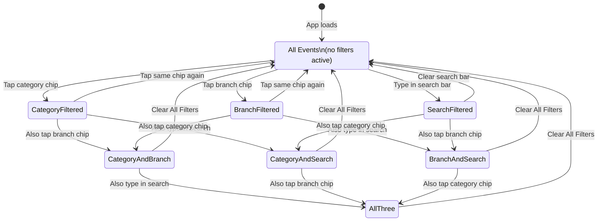

### 5.7 Event Card Data Model

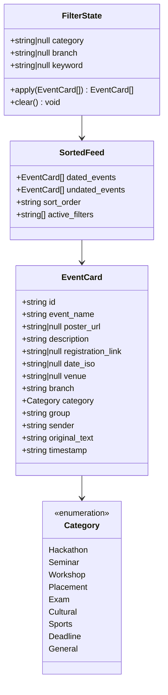

### 5.8 Tech Stack

| Layer | Technology |
|---|---|
| WhatsApp Integration | Baileys (@whiskeysockets/baileys) |
| Backend | Node.js + Express |
| Real-time | Socket.io |
| AI | Google Gemini API (gemini-1.5-flash) |
| Frontend | React + Tailwind CSS |
| Routing | React Router |
| Database (Prototype) | JSON flat files |
| Database (Production) | MongoDB |

### 5.9 API Endpoints

| Method | Endpoint | Description |
|---|---|---|
| GET | `/events` | All structured events, sorted by date |
| GET | `/events?category=Hackathon` | Events filtered by category |
| GET | `/events?branch=CSE` | Events filtered by branch |
| GET | `/events?search=DSA` | Events matching keyword |
| GET | `/events/:id` | Single event by ID |
| GET | `/health` | Server health check |

Note: `messages.json` is stored internally for processing but no API endpoint exposes raw messages to the frontend.

### 5.10 Gemini API Prompt Design

```
You are an academic event extraction assistant for a college campus.

Today's date is {current_date}. Use this to interpret all relative date references
(e.g. "this Friday", "next week", "25th March") into absolute ISO 8601 dates.

Below are recent messages from various college WhatsApp groups.
For each message that contains an event, announcement, opportunity, or deadline,
extract and return a structured JSON object.

Ignore casual chatter, memes, greetings, and messages with no actionable content.

Return a JSON array. Each object must have exactly these fields:
{
  "event_name": "short clear title of the event",
  "poster_url": "image URL if a poster was shared in this message, else null",
  "description": "2-3 sentence clean description of the event",
  "registration_link": "any registration or info URL found, else null",
  "date_iso": "ISO 8601 date string if a date is mentioned, else null",
  "venue": "physical location or online platform mentioned, else null",
  "branch": "which branch(es) this is for — e.g. CSE, ECE, All, ME+CE. Use All if open to everyone.",
  "category": "exactly one of: Hackathon | Seminar | Workshop | Placement | Exam | Cultural | Sports | Deadline | General",
  "group": "name of the WhatsApp group this came from",
  "sender": "sender display name",
  "original_text": "the raw original message verbatim",
  "timestamp": "ISO timestamp of when the message was received"
}

Category classification rules:
- Hackathon: any competitive coding, building, or ideation event
- Seminar: guest lectures, talks, expert sessions, panel discussions
- Workshop: hands-on practical skill-building sessions
- Placement: job drives, internship listings, company visits, PPTs
- Exam: internal tests, makeup exams, assessment circulars
- Cultural: fests, performances, art, music, dance, drama
- Sports: athletic events, trials, inter-college tournaments
- Deadline: registration or submission deadlines with no associated physical event
- General: everything else — use sparingly, only when no other category fits

Return only valid JSON array. No explanation. No markdown.

Messages:
{messages}
```

---

## 6. Pages

CampusSync has two pages. There is no raw feed page — students only ever see fully processed, structured events.

### 6.1 Navigation Map

```mermaid
graph LR
    LAUNCH[App Launch] --> HOME

    HOME[/ — All Events] -->|click event card| DETAIL
    HOME -->|type in search| HOME
    HOME -->|tap category chip| HOME
    HOME -->|tap branch chip| HOME

    DETAIL[/events/:id — Event Detail] -->|click Back| HOME
    DETAIL -->|click Register Now| EXTERNAL[External Registration URL\nopens new tab]

    HOME & DETAIL --> TOAST[LiveToast\nappears on new_event socket event]
    TOAST -->|click View| DETAIL
```

---

### 6.2 Page 1 — All Events (`/`)

**Purpose:** The homepage and only browsing surface of CampusSync. Shows every AI-processed event, sorted by date. No login required. No raw messages visible anywhere.

**Layout:**

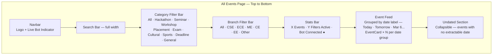

**Components:**

- `Navbar` — CampusSync logo with green pulsing live dot. No tabs — this is the only feed view.
- `SearchBar` — full-width text input, debounced 300ms, clears with × button, searches event_name and description fields
- `CategoryFilterBar` — horizontally scrollable chip row. "All" selected by default. Active chip highlighted in its category color. Tapping an active chip deselects it.
- `BranchFilterBar` — same pattern. "All Branches" selected by default. Options: All, CSE, ECE, ME, CE, EE, Other.
- `StatsBar` — shows total visible event count, number of active filters, and bot connection status
- `EventFeedList` — renders date group headers (Today, Tomorrow, then formatted dates) with `EventCard` components under each. "Undated" section collapses at bottom.
- `EventCard` — see Section 7
- `LiveToast` — slides in from bottom when Socket.io emits `new_event`. Shows group source and a "View" button.

**Behaviour:**
- On load: calls `GET /events`, renders all results sorted by date
- On search: calls `GET /events?search=query` after 300ms debounce, combined with active filters
- On category chip: calls `GET /events?category=X`, combined with active branch/search
- On branch chip: calls `GET /events?branch=X`, combined with active category/search
- On `new_event` socket event: inserts card at correct date position, shows `LiveToast`
- "Clear Filters" button appears only when at least one filter is active

---

### 6.3 Page 2 — Event Detail (`/events/:id`)

**Purpose:** Full detail view of a single structured event. All eight AI-extracted fields displayed as separate, distinct visual blocks.

**Layout:**

```mermaid
graph TD
    subgraph EventDetailPage [Event Detail Page — Top to Bottom]
        BACK[Back Button → All Events\npreserves active filters]
        POSTER2[Poster Block\nFull-width hero image 220px\nOR category-colored placeholder if null]
        CATBRANCH[Category Badge + Branch Chip\nside by side]
        TITLE[Event Name — 2xl bold]
        DATEVENUE[Date Chip + Venue Chip\nside by side row]
        DESC[Description — full prose untruncated]
        REGBTN2[Register Now →\nFull-width green button — only if link exists]
        SOURCE[Source Info\nGroup · Sender · Received timestamp — muted]
        RAWACCORDION[Original Message\nCollapsible accordion — verbatim WhatsApp text]
    end

    BACK --> POSTER2 --> CATBRANCH --> TITLE --> DATEVENUE --> DESC --> REGBTN2 --> SOURCE --> RAWACCORDION
```

**Components:**

- `BackButton` — navigates to `/` with previous filter state preserved via URL params or React state
- `PosterBlock` — three states: placeholder (dashed border, category color tint, category icon), loading shimmer, filled (cover image with expand fullscreen + download buttons top-right corner)
- `CategoryBadge` — colored pill matching category color table in Section 9
- `BranchChip` — branch string as small outline pill
- `EventTitle` — 2xl Syne bold heading, full text no truncation
- `DateChip` — calendar icon + formatted date; red background if within 3 days; shows "Date TBA" if date_iso is null
- `VenueChip` — location pin icon + venue string; shows "Venue TBA" if venue is null
- `DescriptionBlock` — full prose, relaxed line height, no truncation
- `RegisterButton` — full-width green CTA, opens registration_link in new tab; does not render if registration_link is null
- `SourceInfo` — group name, sender name, received timestamp in muted small text
- `RawMessageAccordion` — collapsed by default; expands to show original_text verbatim

**Behaviour:**
- On load: calls `GET /events/:id`, renders all fields
- Null handling: poster → placeholder, date → "Date TBA", venue → "Venue TBA", link → no button
- Back button returns to `/` with filters intact

---

### 6.4 Page Transitions & Filter State Preservation

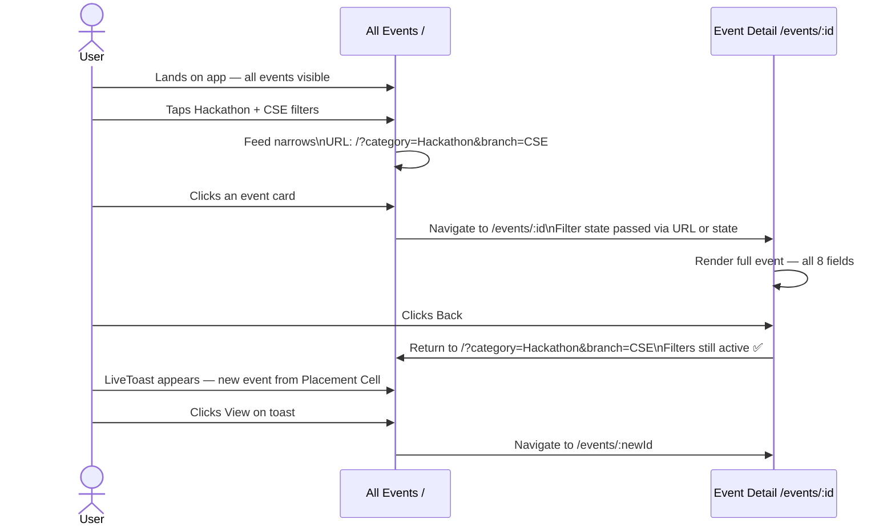

---

## 7. User Flows

### 7.1 Default App Launch

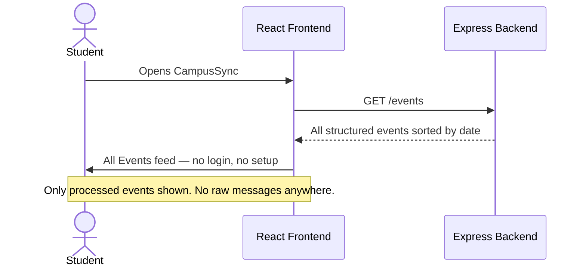

### 7.2 Search & Filter Flow

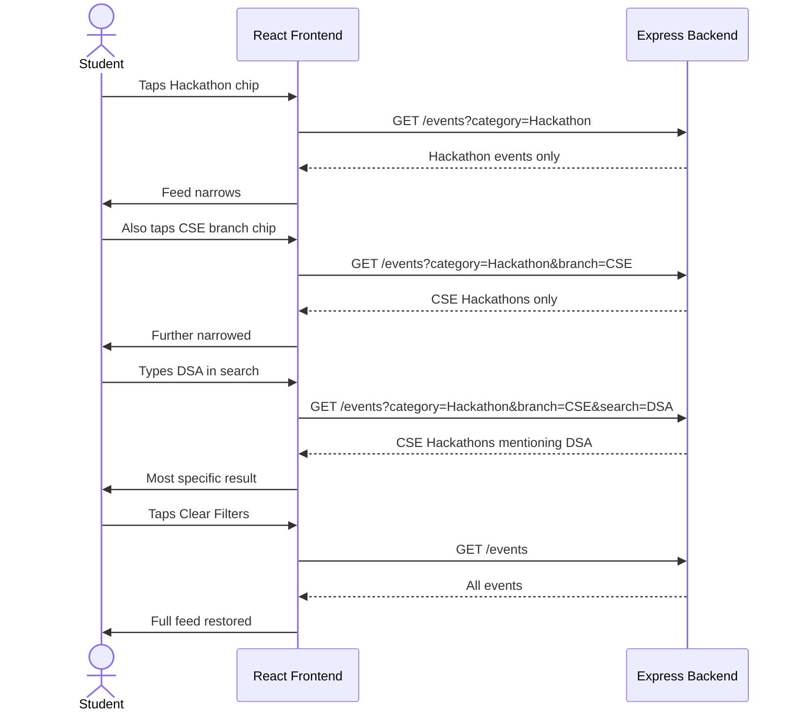

### 7.3 Real-Time New Event Flow

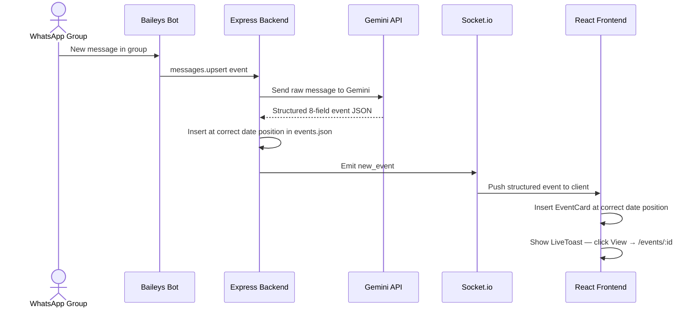

### 7.4 Event Detail Flow

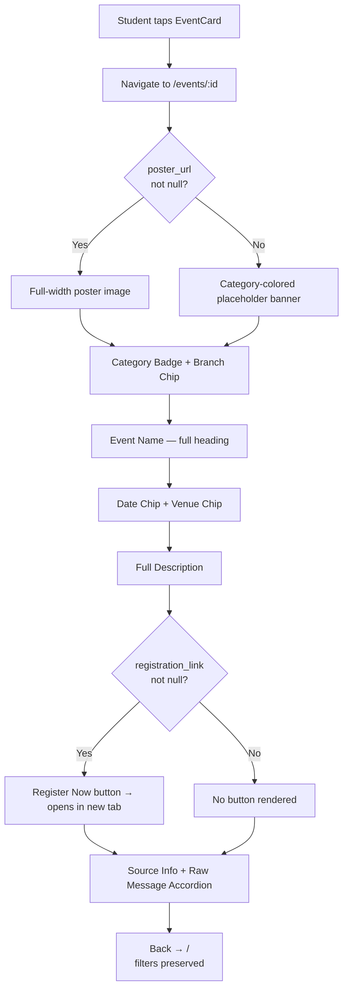

---

## 8. Interface — Event Card Fields

### Card Summary View (All Events Feed)

| Element | Display Style |
|---|---|
| **Category Badge** | Top-left colored pill — unique color per category |
| **Branch Chip** | Top-right small pill — e.g. "CSE" or "All" |
| **Event Name** | Bold heading, 2 lines max, truncated |
| **Poster Thumbnail** | 80×80px top-right thumbnail if poster_url exists |
| **Date Chip** | Calendar icon + date — red background if within 3 days |
| **Venue** | Location pin icon + venue string, muted |
| **Description** | 2-line truncated preview |

### Card Detail View (`/events/:id`)

| Element | Display Style |
|---|---|
| **Poster** | Full-width hero image, 220px, cover fit |
| **Category Badge + Branch Chip** | Side by side below poster |
| **Event Name** | 2xl bold, full text |
| **Date Chip** | Large, clock icon, red if within 3 days, "Date TBA" if null |
| **Venue Chip** | Location pin, "Venue TBA" if null |
| **Description** | Full untruncated prose |
| **Registration Link** | Full-width green "Register Now →" button — hidden if null |
| **Source Info** | Group + sender + timestamp, muted small |
| **Original Message** | Collapsible accordion |

---

## 9. Category Color Mapping

| Category | Color | Hex |
|---|---|---|
| Hackathon | Purple | #a78bfa |
| Seminar | Blue | #60a5fa |
| Workshop | Cyan | #22d3ee |
| Placement | Green | #4ade80 |
| Exam | Red | #f87171 |
| Cultural | Pink | #f472b6 |
| Sports | Orange | #fb923c |
| Deadline | Amber | #fbbf24 |
| General | Gray | #94a3b8 |

---

## 10. Demo Script (Hackathon)

**Duration:** 3–4 minutes

1. **Open the app — no login, all events visible** — *"CampusSync opens straight to structured event cards. No account, no setup, no raw messages."*

2. **Show All Events Feed** — cards sorted by date. Point to each field on a card: *"Gemini extracted the event name, category, branch, date, venue, description, and registration link — all as separate fields from a raw WhatsApp message."*

3. **Tap Hackathon chip** — feed narrows. *"One tap, only hackathons."*

4. **Add CSE branch + type DSA in search** — *"Now only CSE hackathons mentioning DSA. All three filters combined."*

5. **Tap Clear Filters** — full feed restored.

6. **Tap a card → Event Detail page** — show poster, each field as its own block, then tap Register Now.

7. **Live demo** — send a WhatsApp message to a connected group. Watch it appear as a structured event card at the correct date position in the feed.

---

## 11. Scope & Constraints

### In Scope (Prototype)
- Baileys WhatsApp bot connected to 3–5 college groups
- No authentication, no profile setup, no login of any kind
- No raw feed — only AI-processed structured events are shown
- Two pages: All Events (`/`) and Event Detail (`/events/:id`)
- AI structured event extraction via Gemini API — 8 fields per event
- 9 event categories with color coding
- Branch as an AI-extracted event field
- Date-based chronological sorting, soonest first
- Search by keyword, filter by category and branch — combinable
- Real-time updates via Socket.io

### Out of Scope (Prototype)
- Raw feed or any unprocessed message view
- Student profile or personalization
- Authentication or login
- Email ingestion
- Mobile app
- Push notifications
- Multi-college support
- Admin dashboard

### Known Constraints
- Baileys is unofficial and subject to Meta's ToS — acceptable for prototype
- Gemini API requires internet connectivity during demo
- Gemini API free tier has a rate limit (~15 RPM for Flash). For the demo, bot connections are limited to 3–5 low-traffic groups to stay within quota
- Poster extraction depends on whether an image was shared in the group message
- Date parsing uses `{current_date}` injected into the prompt — Gemini resolves relative references ("this Friday", "next week") relative to this value
- Branch defaults to "All" if the original message doesn't mention eligibility
- Concurrent writes to `events.json` are serialized via an in-memory async queue to prevent file corruption
- Flat file JSON database not suitable beyond prototype scale

---

## 12. Success Metrics (Hackathon)

- Bot successfully ingests live messages from at least 3 WhatsApp groups
- Gemini correctly extracts all 8 structured fields for at least 80% of demo messages
- All 9 event categories correctly classified across demo messages
- Events sorted by date — soonest first — visible at a glance
- Search and category/branch filters work and combine correctly
- Event detail page shows all 8 fields as distinct visual elements
- No raw messages, no login screen, no profile setup appears at any point
- Demo runs end-to-end without errors in front of judges

---

*Built for AMD Slingshot Hackathon 2026*
